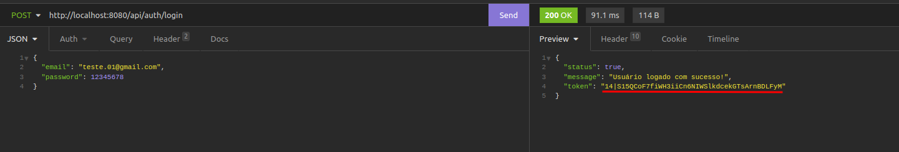
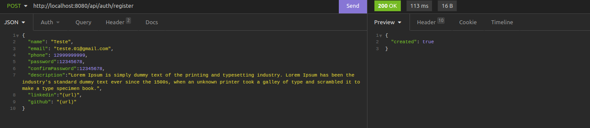

# Api de autenticação

## Requisitos

- Composer
- Docker
## Vamos começar

Primeiro renomeie o arquivo `.env.example` para `.env` e depois preencha as variáveis de ambiente.


`.env`
|Váriavel  |Valor  |
|---------|---------|
|APP_URL     |(Insira url da aplicação )      |
|APP_KEY     |Execute o comando `php artisan key:generate`         |
|APP_ENV|(**local**: para ambiente de desenvolvimento, **production**: para ambiente de produção)|
|APP_DEBUG|(**true**: para ambiente de desenvolvimento, **false**: para ambiente de produção)|
|DB_CONNECTION     |mysql        |
|DB_HOST|mysql|
|DB_PORT|3306|
|DB_DATABASE     |defina o nome desejado para a base de dados         |
|DB_USERNAME|defina o usuário desejado para a base de dados|
|DB_PASSWORD     |defina a senha desejada para a base de dados         |
   

--------

Agora execute os comandos abaixo: 

```bash

composer update

./vendor/bin/sail up -d ou sail up -d

```

Abra [http://localhost:8080](http://localhost:8080) com o seu navegador e vejá o resultado.

## Migrations

Agora execute os comandos das migrations

```bash

./vendor/bin/sail artisan migrate

./vendor/bin/sail artisan db:seed

```
## Usuário admin
Para acessar as rotas especificas para admin crie um usuário admin usando o comando

```bash

./vendor/bin/sail artisan custom:create-user-admin

```

## Rotas

Utilize alguma plataforma de API
ps: Eu usei o insominia

### Rotas de usuário
    
|Metodo  |Rota  |Descrição  |
|---------|---------|---------|
|GET     |/api/user         |Obtem o usuário logado         |
|PUT     |/api/user/{id}         |Edita o usuário         |
|DELETE     |/api/user/{id}         |Exclui o usuário         |


----
### Rotas de autenticação

|Metodo  |Rota  |Descrição  |
|---------|---------|---------|
|POST     |/api/auth/login         |Loga o usuário         |
|POST     |/api/auth/register         |Cadastra um usuário         |
|POST     |/api/auth/logout         |Desloga o usuário         |


---- 
### Rotas de admin

|Metodo  |Rota  |Descrição  |
|---------|---------|---------|
|GET     |/api/adm/users/{id}         |Mostra um usuário em especifico         |
|GET     |/api/auth/register         |Mostra todos os usuários         |


----
## Obs
todas as rotas utilizam o token de autenticação recebido da rota de login



Com esse token é possivel acessar todas as outras rotas.


## Corpo das requisições (JSON)

- Rota de cadastro de usuário
    - 
- Rota de editar usuário
    - 


